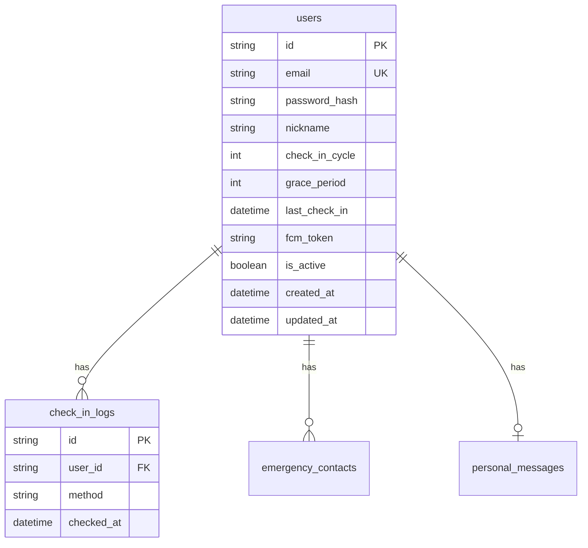

# ERD 설계 체크리스트

## 테이블 네이밍
- [ ] snake_case 사용
- [ ] 복수형 사용 (users, orders)
- [ ] 명확한 도메인 의미 반영

## Primary Key
- [ ] UUID 사용 (String 36)
- [ ] `id` 컬럼명 사용
- [ ] 자동 생성 설정

## 컬럼 규칙
- [ ] snake_case 사용
- [ ] NOT NULL 기본, nullable 명시적 표기
- [ ] 적절한 타입 선택
- [ ] 인덱스 필요 컬럼 표시

## 타임스탬프
- [ ] `created_at` 포함
- [ ] `updated_at` 포함
- [ ] `timezone=True` 설정

## 관계 (Relationship)
- [ ] 1:1, 1:N, N:M 명확히 표시
- [ ] FK 컬럼 `{table}_id` 형식
- [ ] CASCADE 삭제 정책 명시

---

## Mermaid ERD 템플릿

---

## 테이블 설명 템플릿
| 테이블 | 설명 | 주요 관계 |
|--------|------|----------|
| users | 사용자 정보 | 1:N (contacts, logs) |
| check_in_logs | 체크인 기록 | N:1 (users) |

## 완료 확인
- [ ] SPEC.md 요구사항 반영 완료
- [ ] 모든 엔티티 정의 완료
- [ ] 관계 설정 완료
- [ ] ARCHITECT → BACKEND_DEV 인계 준비
